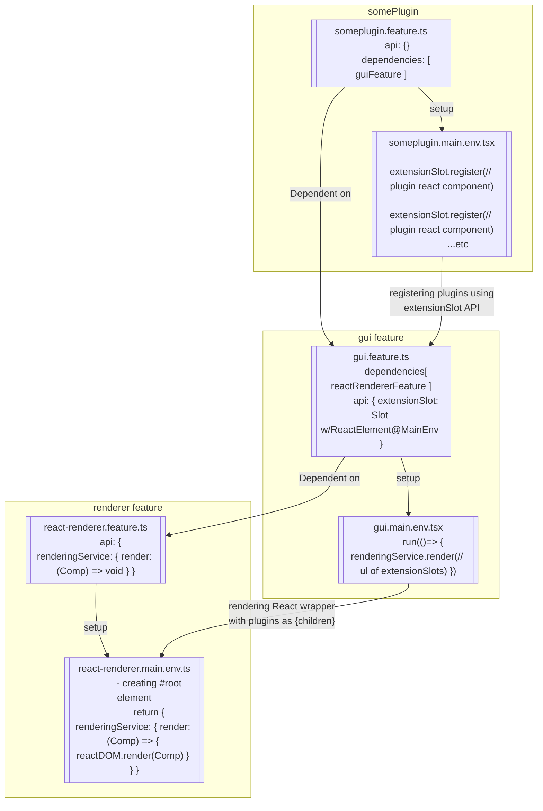

## How to run it

- Go to example react `Feature` (`examples/react`).
- Type (in terminal): `yarn engineer start`
- Inside the dashboard, select `somePlugin` to see all plugins running.

```mermaid
flowchart TD
    rendererFeature -- "setup" --> rendererSetup
    guiFeature -- "setup" --> guiSetup
    somepluginFeature -- "setup" --> somepluginSetup

    guiSetup -- "rendering React wrapper
    with plugins as {children}" --> rendererSetup

    guiFeature -- "Dependent on" --> rendererFeature

    somepluginFeature -- "Dependent on" --> guiFeature

    somepluginSetup -- "registering plugins using
    extensionSlot API
    " --> guiFeature


    subgraph renderer["renderer feature"]
        rendererFeature[["
            react-renderer.feature.ts
            api: { renderingService: { render: (Comp) => void } }
        "]]

        rendererSetup[["
            react-renderer.main.env.ts
            - creating #root element
            return { renderingService: { render: (Comp) => { reactDOM.render(Comp) } } }
        "]]
    end

    subgraph gui["gui feature"]
        guiFeature[["
            gui.feature.ts
            dependencies[ reactRendererFeature ]
            api: { extensionSlot: Slot w/ReactElement@MainEnv }
        "]]

        guiSetup[["
            gui.main.env.tsx
            run(()=> { renderingService.render(// ul of extensionSlots) })
        "]]
    end

    subgraph somePlugin["somePlugin"]
        somepluginFeature[["
            someplugin.feature.ts
            api: {}
            dependencies: [ guiFeature ]
        "]]

        somepluginSetup[["
            someplugin.main.env.tsx
            extensionSlot.register(// plugin react component)
            extensionSlot.register(// plugin react component)
            ...etc
        "]]
    end
```
