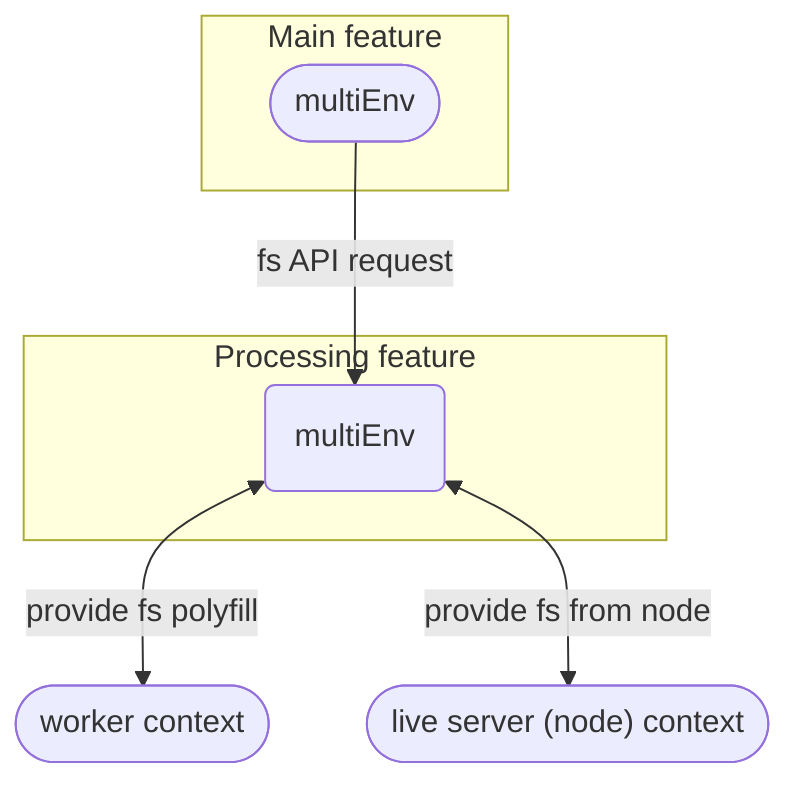

## Environments

### Multi-env

When working on an environment that is requiring a specific environment API we will create a "contextual" environment (defined as `Environment` but not exported).
For example, If we are in the `main` env and we need the `fs` module from the `processing` env, The processing will provide it for the `main`.

The `main` shouldn't know which env provides the `fs` module since it could come from either a worker env or a node server.

