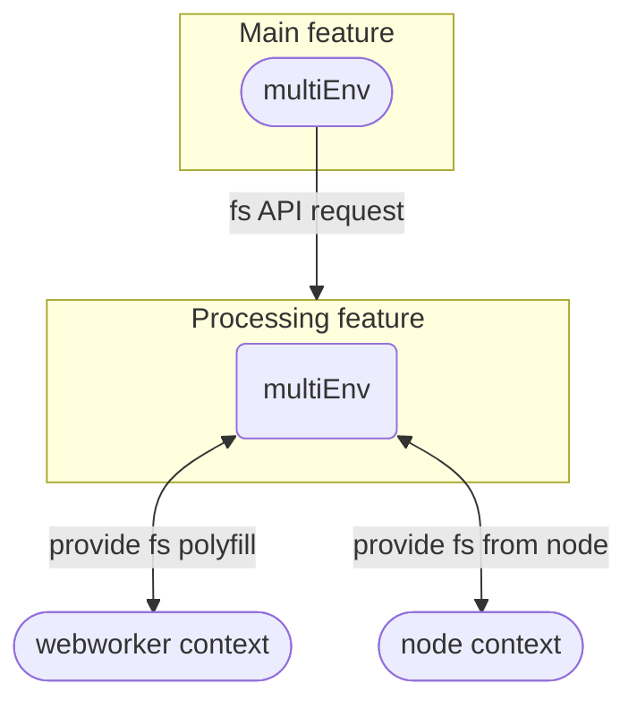

# Multi environment application

### Multi-env

When working on an environment that is requiring a specific environment API we will create a "contextual" environment (
defined as `Environment` but not exported).
For example, If we are in the `main` env and we need the `fs` module from the `processing` env, The processing will
provide it for the `main`.

The `main` shouldn't know which env provides the `fs` module since it could come from either a webworker env or a node
server.

**Assumptions**

- Multi env on main interacts with multiEnv on processing
- Main is not aware of the contexts of processing (node/webworker etc..)
- node/webworker contexts provide the platform specific APIs to the `processing` env
  (actual API or polyfill)

